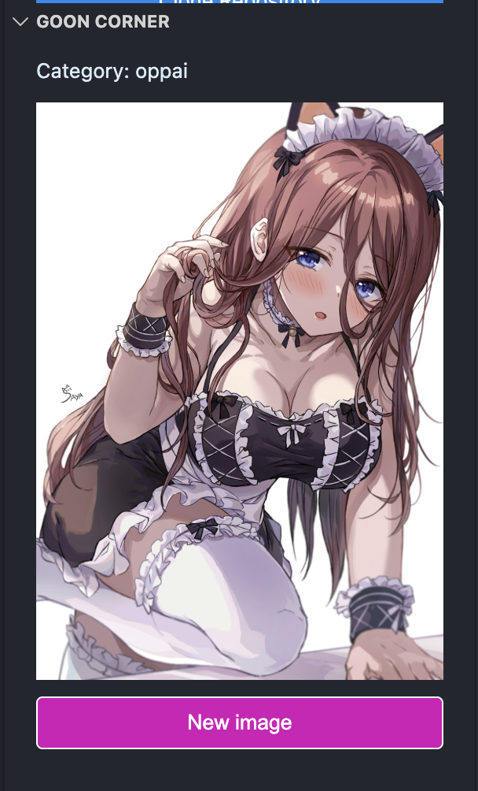
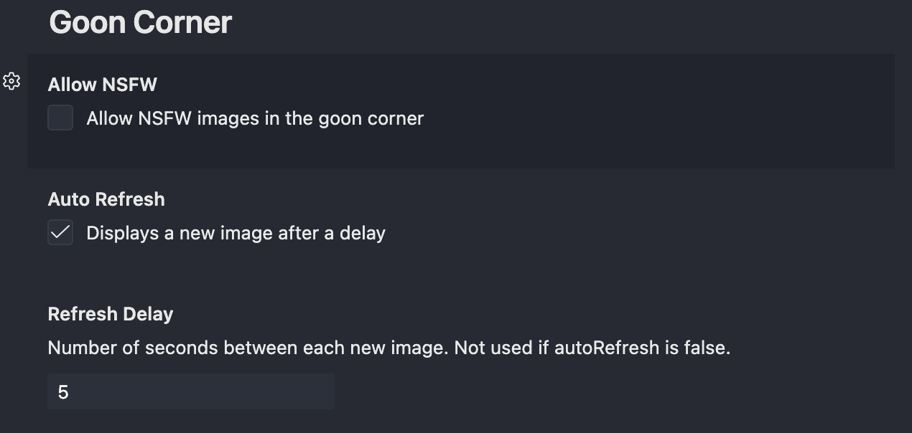

# vsgoon© README

this is the perfect extension when you are bored of your code. just open the `vsgoon©` extension and relax. this extension also can help you focus when working on a difficult task, such as centering a div with claude code.

## settings

mess around with the settings to unlock the full potential of the `vsgoon©` extension.